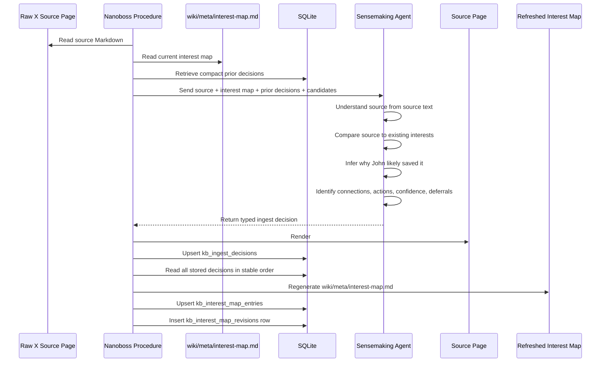
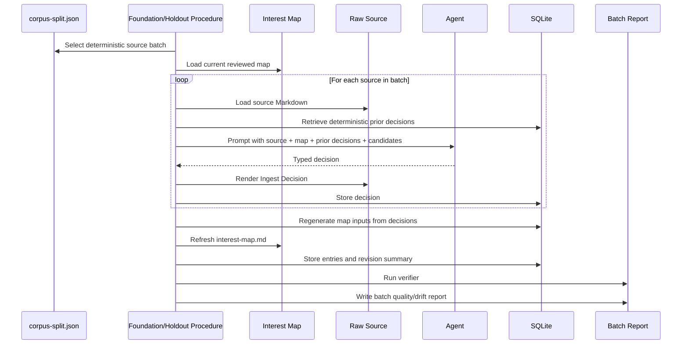

# Interest Map Ingestion Flow

This document explains how `wiki/meta/interest-map.md` is intended to guide
interest-aware X bookmark ingestion, how it relates to SQLite state, and what
should be improved before expanding into phase-two workflows.

## Short Version

Yes: during additional bookmark ingestion, the current interest map is read into
the agent's prompt context and used as the routing layer for sensemaking.

For each source, the agent receives:

- the raw X bookmark Markdown;
- the current `wiki/meta/interest-map.md`;
- deterministic prior-decision context from SQLite;
- candidate related wiki pages where available.

The agent then answers:

```text
Why did John save this, and what does it connect to?
```

The output is a typed ingest decision. Deterministic procedure code renders that
decision into the source page, stores it in SQLite, and refreshes the interest
map from stored decisions.

## Key Artifacts

### Raw Source Page

Raw bookmark files live under:

```text
raw/x/inbox/
raw/x/ingested/
raw/x/ignored/
```

Each source page contains the captured post/thread text, links, media metadata,
raw JSON, and after sensemaking, a rendered section:

```markdown
## Ingest Decision

- Why likely saved: ...
- Matched interests: ...
- Non-obvious connections: ...
- Actions taken: ...
- Confidence: ...
```

This section is the human-auditable answer for a single bookmark.

### Interest Map Markdown

The human-facing map lives at:

```text
wiki/meta/interest-map.md
```

It is intended to be:

- readable in Obsidian or any Markdown viewer;
- editable by John when names, clusters, or framing are wrong;
- compact enough to include in future ingest prompts;
- source-linked so examples can be inspected quickly.

The map is not meant to be a final ontology. It is a working routing surface.

### SQLite Decision Records

The durable machine-readable decision log is:

```sql
kb_ingest_decisions
```

Each row stores one source's decision:

```text
source_id
raw_path
status
why_saved
matched_interests_json
non_obvious_connections_json
candidate_pages_json
actions_json
confidence
defer_reason
created_at
updated_at
```

These rows are the canonical machine-readable basis for deterministic interest
map refreshes.

### SQLite Interest Map Revisions

The revision metadata table is:

```sql
kb_interest_map_revisions
```

It stores:

```text
revision_label
markdown_path
summary_json
source_count
created_at
```

It does not currently store the full Markdown map. The Markdown file remains the
human-editable artifact. SQLite stores compact metadata and a JSON summary for
inspection and future retrieval.

### SQLite Interest Map Entries

The normalized routing table is:

```sql
kb_interest_map_entries
```

It stores queryable state for each map entry:

```text
interest_id
name
description
status
aliases_json
parent_interest_id
example_sources_json
source_count
confidence_json
created_at
updated_at
```

`interest-map.md` remains the human-facing artifact. This table is used by
verification, reconciliation, and prior-decision retrieval.

## Current Flow



## What The Agent Uses The Map For

The interest map should help the agent decide whether a new bookmark is:

- a clear match for an existing interest;
- evidence for an adjacent or emerging interest;
- a low-signal source that should be ignored;
- a media-primary source that should be deferred;
- a source that raises a recurring open question;
- a source that warrants a new semantic page or later synthesis.

The map is especially useful for phase two because it gives the agent continuity
across batches. Without it, each bookmark is judged mostly in isolation. With it,
the agent can ask:

```text
Does this support, refine, contradict, or extend something already visible in
John's saved-bookmark patterns?
```

## Deterministic Refresh

The refresh path reads `kb_ingest_decisions` in stable `source_id` order, groups
matched interests by stable interest ID, preserves existing manual names,
descriptions, aliases, and seeded entries where possible, dedupes recurring
questions, renders Markdown source links relative to `wiki/meta/interest-map.md`,
upserts `kb_interest_map_entries`, inserts a revision row, and runs the verifier.

The map shape is:

```markdown
### agentic-coding-workflows

- Name: Agentic Coding Workflows
- Status: active
- Description: ...
- Aliases: coding agents, AI coding workflows
- Parent interest: none
- Related interests: agent-orchestration
- Source count: 6
- Confidence: {"high":4,"medium":2}
- Manually seeded: no
- Example sources: [2013164033726120070](../../raw/x/ingested/2013164033726120070.md)
- Signals: ...
```

IDs are lowercase slugs and should remain stable even when display names improve.

The map currently uses generated Markdown links like:

```markdown
[2011562190286045552](../../raw/x/ingested/2011562190286045552.md)
```

Because `interest-map.md` lives in `wiki/meta/`, the `../../raw/...` path points
back to the raw source tree.

## What SQLite Does And Does Not Store

SQLite stores the ingest decisions, normalized interest entries, and map revision
metadata. The practical ownership model is:

```text
kb_ingest_decisions -> deterministic map renderer -> interest-map.md
interest-map.md -> reconcile -> kb_interest_map_entries
kb_interest_map_revisions -> compact summaries and audit trail
```

Manual edits to `interest-map.md` are parsed by the reconcile path before they
become machine-readable state.

## Manual Edit Workflow

Use the Nanoboss maintenance procedure:

```bash
nanoboss xbookmarks/wiki-interest-map "reconcile --dry-run"
nanoboss xbookmarks/wiki-interest-map "reconcile --yes"
```

Dry run reports new interest IDs, renamed interests, alias changes, deprecated
interests, invalid source links, and entries that cannot be parsed safely. Apply
mode upserts parsed entries into `kb_interest_map_entries` only when the map has
no unsafe parse errors or invalid source links.

## Verifier

Run:

```bash
nanoboss xbookmarks/wiki-interest-map "verify"
```

The verifier checks:

- every example source link resolves from `wiki/meta/interest-map.md`;
- every example source has a `kb_ingest_decisions` row;
- map source counts match `kb_interest_map_entries`;
- deferred-media counts match `kb_ingest_decisions`;
- recurring questions are deduped;
- placeholder headings such as `No strong match` are not core interests;
- every interest has an ID, name, status, and description;
- every active interest has at least one example source or `Manually seeded: yes`.

Verifier artifacts are written to:

```text
.nanoboss/xbookmarks/runs/<run-id>/interest-map-verify.md
.nanoboss/xbookmarks/runs/<run-id>/interest-map-verify.json
```

## Prior-Decision Retrieval

Use:

```bash
nanoboss xbookmarks/wiki-interest-map "prior-decisions --source raw/x/ingested/ID.md --limit 12"
```

The retrieval helper is also used automatically when sensemaking prompts are
built. It scores prior decisions by deterministic keyword overlap with interest
IDs, names, aliases, and matched-interest text, plus same-author and
media-primary/deferred-media signals.

Returned context includes source ID, raw path, Markdown link, status, why saved,
matched interests, non-obvious connections, confidence, defer reason, score, and
retrieval reasons. It is context only; source-grounded understanding still comes
from the current source markdown.

## How This Supports Phase Two

Phase two plans to process the remaining older foundation corpus, preserve the
most recent 100 bookmarks as a holdout, and later support daily ingestion.

The interest map helps phase two by providing:

- a compact summary of known interest clusters;
- examples linked to raw sources for human and agent inspection;
- a place to see emerging themes before creating permanent semantic pages;
- a routing guide for deciding whether a source matches, extends, or diverges
  from known interests;
- continuity across batches.

The current map is good enough as a phase-one baseline, but it should be hardened
before large-scale phase-two ingestion.

## Recommended Improvements Before Phase Two

### 1. Stable Interest IDs

The map uses stable IDs in headings and revision summary JSON:

```markdown
### agentic-coding-workflows

- Name: Agentic Coding Workflows
- Status: active
- Description: ...
- Example sources: ...
```

This makes future matching less sensitive to wording changes.

### 2. Manual Map Edits

The reconcile path reads the Markdown map and extracts:

- interest IDs;
- preferred names;
- descriptions;
- aliases;
- parent/related interests;
- deprecated interests.

### 3. Richer Map Representation In SQLite

The normalized table is:

```sql
CREATE TABLE IF NOT EXISTS kb_interest_map_entries (
  interest_id TEXT PRIMARY KEY,
  name TEXT NOT NULL,
  description TEXT,
  status TEXT NOT NULL,
  aliases_json TEXT,
  parent_interest_id TEXT,
  example_sources_json TEXT,
  source_count INTEGER NOT NULL DEFAULT 0,
  confidence_json TEXT,
  created_at TEXT NOT NULL,
  updated_at TEXT NOT NULL
);
```

This makes the interest map easier to query, diff, test, and use for retrieval.

### 4. Map Verifier

The verifier checks:

- every example source link resolves;
- every example source has a decision row;
- source counts match SQLite;
- deferred counts match SQLite;
- recurring questions are deduped;
- no obvious placeholder headings such as "No strong match" appear as core
  interests.

It runs after every interest-map refresh.

### 5. Improve Interest Clustering

The current map has useful signals, but it still includes overly broad or
mechanically inferred labels.

Before foundation ingestion, run a deliberate map review pass:

- merge duplicate or near-duplicate interests;
- rename weak generated labels;
- split overly broad clusters;
- move open questions out of core interests;
- mark uncertain or one-off interests as emerging rather than core.

This matters because phase two will use the map to route many more sources.
Weak clusters will compound if they are left as the primary routing surface.

### 6. Keep Media Deferrals First-Class

The baseline correctly deferred many media-primary sources. Phase two should not
collapse these into normal interests until media has been inspected.

The map should continue to expose:

```markdown
## Deferred Media Inspection
```

and SQLite should keep those rows queryable by `status = deferred_media_inspection`.

## Practical Phase-Two Ingest Loop



## Shadow Replay

Before phase two, run a 10-20 source dry-run replay:

```bash
nanoboss xbookmarks/wiki-baseline-replay \
  --split wiki/meta/corpus-split.json \
  --limit 20 \
  --map wiki/meta/interest-map.md \
  --dry-run \
  --write-comparison-report
```

Replay artifacts are written to:

```text
.nanoboss/xbookmarks/runs/<run-id>/baseline-replay-decisions.jsonl
.nanoboss/xbookmarks/runs/<run-id>/baseline-replay-comparison.md
.nanoboss/xbookmarks/runs/<run-id>/baseline-replay-comparison.json
```

Replay mode does not mutate source pages or `kb_ingest_decisions`. The report
compares why-saved text, matched interests, non-obvious connections, actions,
confidence, deferrals, ignored status, and which prior decisions were included.

## Bottom Line

The intended design is:

```text
interest-map.md guides the agent;
kb_ingest_decisions preserves every source-level decision;
kb_interest_map_entries stores queryable routing state;
refreshInterestMap deterministically regenerates and verifies the map;
kb_interest_map_revisions records map refresh metadata and compact summaries.
```

Before phase two, the most important improvement is to make the interest map a
more reliable routing artifact: stable IDs, valid Markdown links, verifier
checks, richer SQLite summaries, and a path for manual edits to influence future
machine-readable state.
