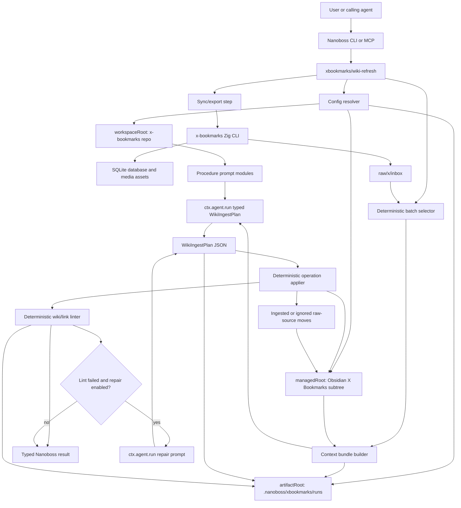
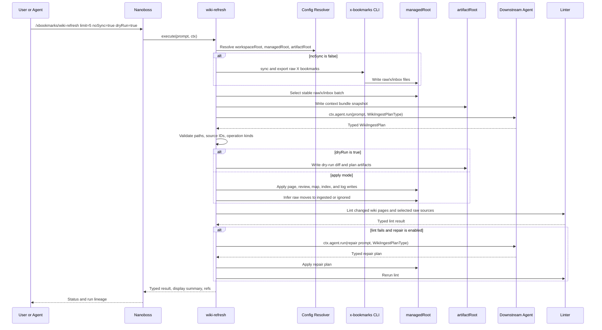

# Nanoboss X Bookmarks Wiki Procedure

This document describes the planned Nanoboss procedure that turns synced
X/Twitter bookmarks into a managed Obsidian wiki. It is the concrete procedure
substrate for the X bookmark knowledge-base pipeline: deterministic code owns
sync, batch selection, context assembly, validation, apply, lint, and
finalization; a bounded downstream agent call owns synthesis into a typed
operation plan.

The implementation is intended to live in this repository under:

```text
.nanoboss/procedures/xbookmarks/
  wiki-refresh.ts
  wiki-lint.ts
  wiki-select-batch.ts
  wiki-apply.ts
  lib/
  prompts/
```

Procedure source under `.nanoboss/procedures/**` is checked into this repo.
Generated run artifacts live under `.nanoboss/xbookmarks/runs/` by default and
are ignored.

## Architecture



The key design constraint is that the agent never edits the wiki directly. It
returns a typed `WikiIngestPlan`. The procedure validates that plan, applies it
deterministically, runs lint, and decides whether the run succeeds.

## Sequence



## Procedure Commands

Start Nanoboss from the `x-bookmarks` workspace:

```bash
cd /Users/jflam/src/x-bookmarks
nanoboss cli
```

Primary entrypoint:

```text
/xbookmarks/wiki-refresh [options]
```

Supporting procedures:

```text
/xbookmarks/wiki-select-batch [options]
/xbookmarks/wiki-lint [options]
/xbookmarks/wiki-apply [options]
```

`wiki-refresh` is the normal end-to-end path. It can sync/export bookmarks,
select a batch, build a context bundle, ask the downstream agent for a typed
plan, apply or dry-run the plan, lint the result, optionally run a bounded
repair loop, and return typed result data.

`wiki-select-batch` is a deterministic inspection command. `wiki-lint` runs
validation without invoking an agent. `wiki-apply` applies a previously
generated plan artifact and is mainly for debugging and tests.

## Parameters

All parameters are supplied as `key=value` tokens in the Nanoboss procedure
prompt. Paths with spaces should be quoted if the prompt parser supports it, or
escaped as shown in the examples.

| Parameter | Applies to | Default | Meaning |
| --- | --- | --- | --- |
| `limit` | `wiki-refresh`, `wiki-select-batch` | `5` for refresh, `25` for select | Maximum raw inbox files to process. |
| `noSync` | `wiki-refresh` | `false` | Skip X API sync and raw export when `true`; process existing inbox files. |
| `dryRun` | `wiki-refresh`, `wiki-apply` | `false` | Validate and produce artifacts without mutating wiki or raw-source files. |
| `managedRoot` | all | required via config/env/options | Managed Obsidian subtree, usually `/Users/jflam/src/brain2/X Bookmarks`. |
| `workspaceRoot` | all | Nanoboss `ctx.cwd` | Procedure workspace, usually this `x-bookmarks` repo. |
| `artifactRoot` | all | `.nanoboss/xbookmarks/runs` | Run artifact root, relative to `workspaceRoot` unless absolute. |
| `xBookmarksBinary` | `wiki-refresh` with `noSync=false` | `zig-out/bin/x-bookmarks` under `workspaceRoot` | Importer binary used for sync/export. |
| `batchId` | `wiki-refresh`, `wiki-select-batch` | generated from run ID | Stable label for selected batch and artifacts. |
| `agent` | `wiki-refresh` | Nanoboss session default | Optional downstream agent selection when supported by Nanoboss. |
| `repair` | `wiki-refresh` | `true` in apply mode, `false` in dry-run mode | Ask the agent for a narrow repair plan after lint failure. |
| `maxRepairAttempts` | `wiki-refresh` | `1`, capped at `2` | Maximum bounded repair loop count. |
| `planPath` | `wiki-apply` | none | Path to a generated `WikiIngestPlan` JSON artifact. |
| `changedOnly` | sync/export step | `true` | Use changed-only raw export behavior when the importer supports it. |
| `fullSync` | sync step | `false` | Run full X bookmark sync before export. |

Unknown parameters should fail fast. Boolean parameters should accept only
`true` or `false`.

## Configuration

The procedure separates the repository workspace from the managed wiki:

- `workspaceRoot`: the repo where the Nanoboss procedure runs, normally
  `/Users/jflam/src/x-bookmarks`.
- `managedRoot`: the Obsidian subtree the procedure is allowed to mutate,
  normally `/Users/jflam/src/brain2/X Bookmarks`.
- `artifactRoot`: run artifact storage, defaulting to
  `<workspaceRoot>/.nanoboss/xbookmarks/runs`.

Resolve configuration in this order:

1. Procedure options such as `managedRoot=...`.
2. Environment variables such as `XBOOKMARKS_MANAGED_ROOT` and
   `XBOOKMARKS_WORKSPACE_ROOT`.
3. Repo-local config at `.nanoboss/xbookmarks/config.json`.
4. Existing `x-bookmarks` config if it contains enough Obsidian root data.
5. Fail with an actionable error.

Example repo-local config:

```json
{
  "workspaceRoot": "/Users/jflam/src/x-bookmarks",
  "managedRoot": "/Users/jflam/src/brain2/X Bookmarks",
  "xBookmarksBinary": "/Users/jflam/src/x-bookmarks/zig-out/bin/x-bookmarks",
  "artifactRoot": ".nanoboss/xbookmarks/runs"
}
```

Only write wiki and raw-source changes under `managedRoot`. Only write run
artifacts under `artifactRoot`. Reject any generated operation that escapes
those roots.

## Example Usage

Inspect the next batch without syncing or writing wiki changes:

```text
/xbookmarks/wiki-select-batch limit=5 managedRoot=/Users/jflam/src/brain2/X\ Bookmarks
```

Run the first end-to-end dry run:

```text
/xbookmarks/wiki-refresh limit=5 noSync=true dryRun=true managedRoot=/Users/jflam/src/brain2/X\ Bookmarks
```

Apply a small already-exported inbox batch:

```text
/xbookmarks/wiki-refresh limit=5 noSync=true managedRoot=/Users/jflam/src/brain2/X\ Bookmarks
```

Sync/export first, then process the next 10 raw sources:

```text
/xbookmarks/wiki-refresh limit=10 noSync=false managedRoot=/Users/jflam/src/brain2/X\ Bookmarks
```

Use repo-local config and only pass behavior flags:

```text
/xbookmarks/wiki-refresh limit=10 noSync=true dryRun=true
```

Run lint only:

```text
/xbookmarks/wiki-lint managedRoot=/Users/jflam/src/brain2/X\ Bookmarks
```

Apply a generated plan artifact:

```text
/xbookmarks/wiki-apply planPath=.nanoboss/xbookmarks/runs/RUN_ID/plan.json managedRoot=/Users/jflam/src/brain2/X\ Bookmarks
```

Write artifacts outside the repo for an experiment:

```text
/xbookmarks/wiki-refresh limit=5 noSync=true dryRun=true artifactRoot=/tmp/xbookmarks-runs managedRoot=/Users/jflam/src/brain2/X\ Bookmarks
```

Run without repair so lint failures surface directly:

```text
/xbookmarks/wiki-refresh limit=5 noSync=true repair=false managedRoot=/Users/jflam/src/brain2/X\ Bookmarks
```

Run a full sync before processing:

```text
/xbookmarks/wiki-refresh limit=25 noSync=false fullSync=true managedRoot=/Users/jflam/src/brain2/X\ Bookmarks
```

## Typed Agent Contract

The agent call should use Nanoboss typed output validation. Nanoboss disk
procedures already support the `typia` and `jsonType(...)` pattern, so the
procedure can describe the expected `WikiIngestPlan` shape without adding a
repo-level TypeScript package or lockfile to `x-bookmarks`.

Sketch:

```ts
import typia from "typia";
import { expectData, jsonType } from "@nanoboss/procedure-sdk";
import type { WikiIngestPlan } from "./lib/types";

const WikiIngestPlanType = jsonType<WikiIngestPlan>(
  typia.json.schema<WikiIngestPlan>(),
  typia.createValidate<WikiIngestPlan>(),
);

const result = await ctx.agent.run(
  buildWikiIngestPrompt({ selected, context }),
  WikiIngestPlanType,
  { stream: false, agent: options.agent },
);

const plan = expectData(result, "Agent returned no wiki ingest plan");
```

The initial operation schema should be narrow:

```ts
type WikiOperation =
  | { kind: "create_page"; path: string; markdown: string; sourceIds: string[] }
  | { kind: "update_page"; path: string; markdown: string; sourceIds: string[] }
  | { kind: "update_review"; path: string; markdown: string; sourceIds: string[] }
  | { kind: "update_map"; path: string; markdown: string; sourceIds: string[] }
  | { kind: "ignore_source"; sourceId: string; reason: string }
  | { kind: "append_log"; markdown: string };

interface WikiIngestPlan {
  summary: string;
  operations: WikiOperation[];
  followUpSources: string[];
  relationshipCandidates: string[];
  spacedRepetitionCandidates: string[];
}
```

## Deterministic Apply Rules

The applier owns filesystem mutation and raw-source movement.

- Reject writes outside `managedRoot`.
- Reject unsupported operation kinds.
- Reject page paths that violate wiki path policy.
- Reject unknown `sourceIds`.
- Reject a source that is both cited and ignored.
- Reject `ignore_source` operations without a non-empty reason.
- Apply page writes atomically where practical.
- Infer raw-source movement after accepted writes succeed.

Raw-source move policy:

- Move a selected source to `raw/x/ignored` when the accepted plan contains
  `ignore_source` for that source.
- Move a selected source to `raw/x/ingested` when it is referenced by an
  accepted page, review, map, or log operation.
- Leave unresolved sources in `raw/x/inbox` and fail apply mode unless a later
  version explicitly supports partial processing.
- Update raw-source frontmatter status during the move.

## Lint Rules

The linter is part of the product, not a cleanup script. It catches the broken
Obsidian links and citations that made earlier prompt-only ingestion fragile.

The v1 linter should use a small local parser for line-oriented Markdown and
Obsidian wikilink checks. Add a general Markdown parser only if a future check
clearly needs it.

Required checks:

- Every raw-source wikilink has a readable alias.
- Raw X citations include both the X embed and the raw Markdown link on the
  same line.
- No human-visible link renders as a path such as
  `../../raw/x/ingested/<id>`.
- No processed source remains cited under `raw/x/inbox`.
- Every raw-source citation resolves to an existing file.
- Every moved raw source has frontmatter `status: ingested` or
  `status: ignored`.
- Every updated page has required frontmatter.
- Changed durable pages are listed in `wiki/index.md`.
- `wiki/log.md` has a structured entry for the run.
- Weekly review `Source Trail` contains every selected source.
- Maps are updated for new durable pages.
- Ignored sources include an explicit reason.

Lint output should be typed and machine-readable, with optional Markdown for
human review:

```text
<artifactRoot>/<run-id>/lint.json
<artifactRoot>/<run-id>/lint.md
```

## Policy Split

`wiki/schema.md` is the durable, user-visible source of truth for wiki policy.
Procedure prompt modules are execution scaffolding for this Nanoboss workflow.

Examples that belong in `wiki/schema.md`:

- page types and frontmatter expectations;
- citation format for raw X sources;
- when to create pages versus update existing pages;
- map and index maintenance policy;
- weekly review page shape;
- source trail requirements;
- spaced-repetition candidate criteria;
- maturity levels such as `seed`, `active`, and `synthesis`;
- policies for contradictions, caveats, ignored sources, and follow-up sources.

Examples that belong in procedure prompt modules:

- request a typed `WikiIngestPlan` and no prose outside JSON;
- list the selected source IDs for this run;
- describe the operation schema the model must fill;
- state that deterministic code, not the model, moves raw files;
- bound the agent to the current batch and context bundle;
- request concise operation summaries for the Nanoboss display;
- instruct repair prompts to fix only provided lint findings.

If a rule should still apply when a human edits the wiki outside the procedure,
put it in `wiki/schema.md`. If a rule only exists to make this procedure return
the right typed payload, put it in the procedure prompt module.

## Expected Result

`wiki-refresh` should return a typed result and a concise display summary with:

- resolved roots;
- selected source IDs;
- context bundle path;
- dry-run versus apply mode;
- pages created and updated;
- maps and review queues updated;
- raw sources ingested or ignored;
- lint status;
- repair attempts;
- follow-up sources;
- relationship-card candidates;
- spaced-repetition candidates.

Nanoboss should own run lineage, refs, child agent call records, cancellation,
and summaries. The X-bookmarks procedure should not create a second run store.
