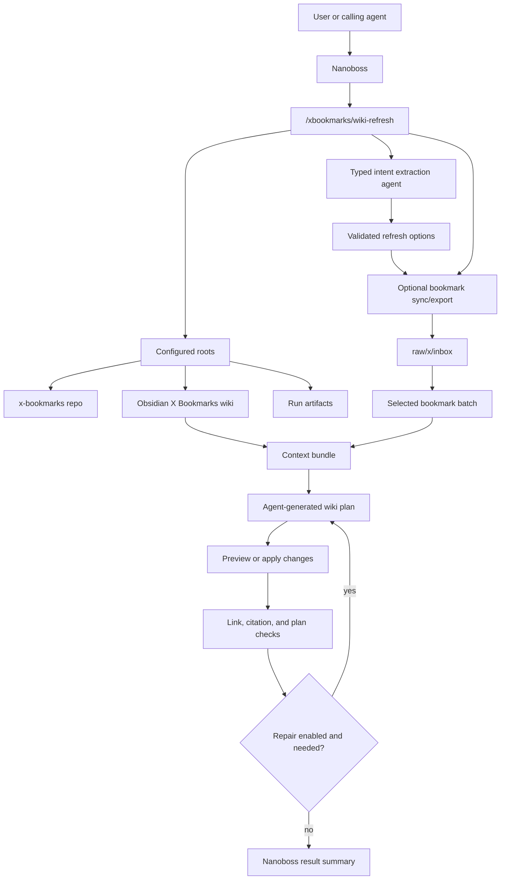
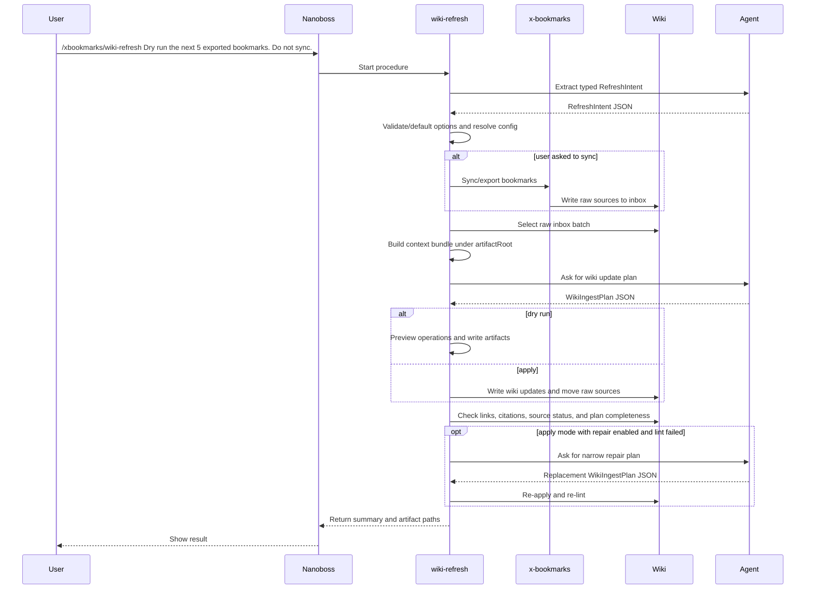

# Nanoboss X Bookmarks Wiki Procedure

This procedure turns exported X/Twitter bookmarks into updates for the managed
Obsidian X Bookmarks wiki. It is meant to be run from Nanoboss with natural
language instructions, not long command-line option strings.

Use it to preview or apply small batches of bookmark-derived wiki updates,
check links and citations, and keep raw bookmark sources moving from inbox to
ingested or ignored.

Implementation contracts and internal type definitions live in
[the implementation plan](../plans/2026-05-13-nanoboss-x-bookmarks-wiki-pipeline.md).

For a fuller operator and reviewer guide with examples for every procedure, see
[`nanoboss-xbookmarks-procedures-guide.md`](nanoboss-xbookmarks-procedures-guide.md).

## Architecture



## Sequence



## One-Time Setup

Run Nanoboss from the `x-bookmarks` repo:

```bash
cd /Users/jflam/src/x-bookmarks
nanoboss cli
```

Create repo-local configuration at:

```text
.nanoboss/xbookmarks/config.json
```

Example:

```json
{
  "workspaceRoot": "/Users/jflam/src/x-bookmarks",
  "managedRoot": "/Users/jflam/src/brain2/X Bookmarks",
  "xBookmarksBinary": "/Users/jflam/src/x-bookmarks/zig-out/bin/x-bookmarks",
  "xBookmarksHome": "/Users/jflam/src/x-bookmarks/data",
  "artifactRoot": ".nanoboss/xbookmarks/runs"
}
```

Normal procedure prompts should not include `managedRoot`, `workspaceRoot`,
`artifactRoot`, or `xBookmarksBinary`. Those are configuration values.

## Commands

Primary workflow:

```text
/xbookmarks/wiki-refresh <natural-language request>
```

Supporting workflows:

```text
/xbookmarks/wiki-select-batch <natural-language request>
/xbookmarks/wiki-lint <natural-language request>
/xbookmarks/wiki-apply <JSON plan request>
/xbookmarks/wiki-build-reviews <natural-language request>
/xbookmarks/wiki-topic-synthesis-refresh <natural-language request>
```

Human-facing prompts should be natural language. Use small batches until the
pipeline is trusted.

## Common Workflows

Preview the next exported batch without syncing:

```text
/xbookmarks/wiki-refresh Dry run the next 5 exported bookmarks. Do not sync.
```

Apply a small already-exported batch:

```text
/xbookmarks/wiki-refresh Process the next 5 exported bookmarks from the inbox.
```

Sync first, then preview or process:

```text
/xbookmarks/wiki-refresh Sync first, then dry run about 10 bookmarks.
```

Run a full sync before processing:

```text
/xbookmarks/wiki-refresh Full sync first, then process 25 bookmarks.
```

Inspect what would be selected:

```text
/xbookmarks/wiki-select-batch Show me the next 5 exported bookmarks that would be processed.
```

Check the wiki without processing a batch:

```text
/xbookmarks/wiki-lint Check the X bookmarks wiki for broken links and citation issues.
```

Build deterministic weekly review source-trail pages from processed sources:

```text
/xbookmarks/wiki-build-reviews Build dry-run review pages for the latest 8 weeks.
```

Refresh existing topic pages using their cited sources and media:

```text
/xbookmarks/wiki-topic-synthesis-refresh Dry run synthesis refresh for wiki/concepts/autonomous-driving-perception.md.
```

Apply a bounded topic synthesis pass for pages that look mechanically repaired
and need deeper analysis:

```text
/xbookmarks/wiki-topic-synthesis-refresh Apply synthesis refresh for the next 3 topics.
```

Stress-test the entire topic wiki under procedural control:

```text
/xbookmarks/wiki-topic-synthesis-refresh Apply synthesis refresh for all topic pages in chunks of 5.
```

Disable automatic repair for a preview:

```text
/xbookmarks/wiki-refresh Dry run the next 5 exported bookmarks without auto-repair.
```

## Prompt Guidance

Use words like these to steer the run:

- `dry run`, `preview`, `simulate`, or `show me` for no wiki mutations.
- `process`, `apply`, or `write changes` when you want the procedure to update
  the wiki.
- `do not sync`, `from inbox`, or `already exported` to use current raw files.
- `sync first` or `fetch latest` to refresh from X before selecting a batch.
- `full sync` only when you explicitly want a slower reconciliation run.
- Include a small number such as `5` or `10` to set the batch size.
- For topic synthesis, include explicit topic paths when you want a specific
  page refreshed. Otherwise the procedure selects high-priority mechanically
  repaired pages first.
- For topic synthesis, `all topic pages` or `everything` enables the procedure's
  deterministic all-mode loop. `chunks of N` controls how many topic pages are
  sent to each agent call.

When the request is ambiguous, the procedure should choose the safer behavior:
small batch, no sync, and dry-run.

## Outputs

`wiki-refresh` should show:

- which roots were used;
- whether the run was dry-run or apply mode;
- selected source count;
- pages that would be or were created and updated;
- raw sources that would be or were ingested or ignored;
- lint status;
- repair attempts, if any;
- follow-up sources, relationship candidates, and spaced-repetition candidates.

`wiki-topic-synthesis-refresh` should show:

- which topic pages were selected;
- whether all-mode was used, the chunk size, and chunks completed;
- the context bundle path containing topic pages, raw sources, and media notes;
- pages that would be or were updated;
- lint status;
- follow-up sources, relationship candidates, and spaced-repetition candidates.

Run artifacts are written under:

```text
<workspaceRoot>/.nanoboss/xbookmarks/runs/
```

Artifacts are for inspection and debugging. The human-facing wiki output remains
under the configured `managedRoot`.

## Safety Model

The procedure should only mutate files under the configured wiki root when it is
not a dry run. Generated artifacts stay under the configured artifact root.

For normal use, start with dry runs. Apply mode should only move raw sources to
`raw/x/ingested` or `raw/x/ignored` after wiki writes and link checks succeed.

## Troubleshooting

If the procedure cannot find the wiki, check `.nanoboss/xbookmarks/config.json`.

If no bookmarks are selected, check:

- the configured `managedRoot`;
- whether raw files exist under `raw/x/inbox`;
- whether the previous run already moved them to `raw/x/ingested` or
  `raw/x/ignored`.

If lint fails, inspect the reported files and artifact paths. Re-run in dry-run
mode after making manual fixes, or run with repair enabled once the failure is
well understood.
